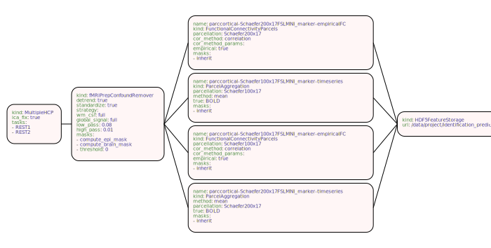
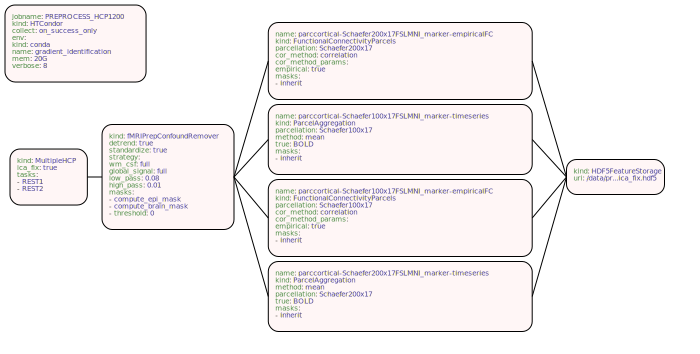

# junigraph

junigraph is a command-line tool to visualise your
[junifer](https://juaml.github.io/junifer/main/index.html) pipelines from
your YAML pipeline specification.

## Install

Install from GitHub:

```bash
pip install git+https://github.com/LeSasse/junigraph.git
```

## Usage:

There are some example YAML files in the `examples` folder. You can run junigraph
as:
```bash
junigraph examples/four_markers.yaml examples/example_four_markers.svg
```
The result can be found here:


As you can see, the image does not quite fit. Luckily, we can also see that
the storage path is quite long, and we can actually truncate it using the
`storage_path_max_length (spml)` option to truncate the length of the path:
```bash
junigraph examples/four_markers.yaml examples/example_four_markers_truncated.svg -spml 20
```
The result now nicely fits into the default canvas:


Alternatively, you can also manually adjust the width and height (and the unit)
and many other parameters. Feel free to play around with them to learn about them.
For example:
```bash
junigraph examples/less_markers.yaml examples/less_markers_custom.svg \
    --width 180 \
    --height 100 \
    --unit mm \
    --fontsize 7 \
    -hs 0.07 \
    -spml 20
```

This results in:


