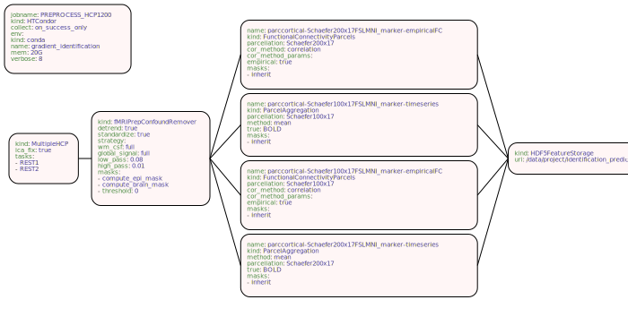

# junigraph

junigraph is a command-line tool to visualise your
[junifer](https://juaml.github.io/junifer/main/index.html) pipelines from
your YAML pipeline specification.

## Install

Install from GitHub:

```bash
pip install git+https://github.com/LeSasse/junigraph.git
```

## Usage:

There are some example YAML files in the `examples` folder. You can run junigraph
as:
```bash
junigraph examples/four_markers.yaml examples/example_four_markers.svg
```
The result can be found here:
